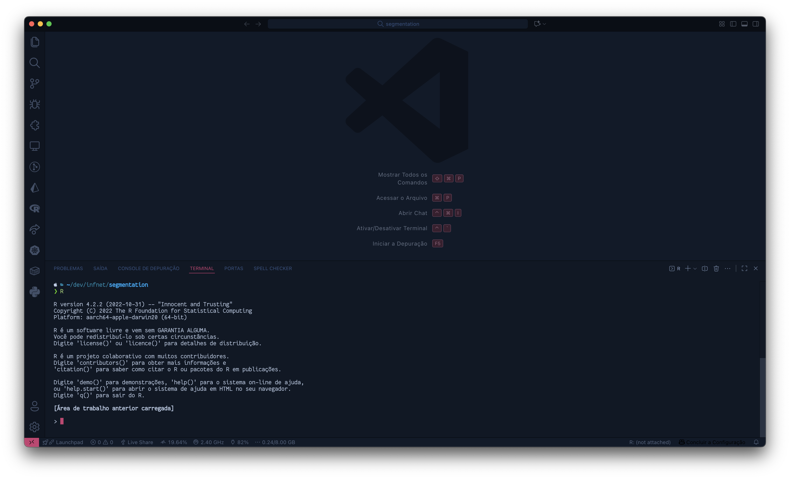
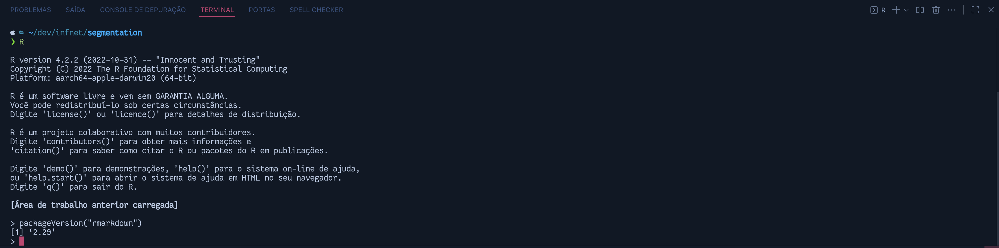
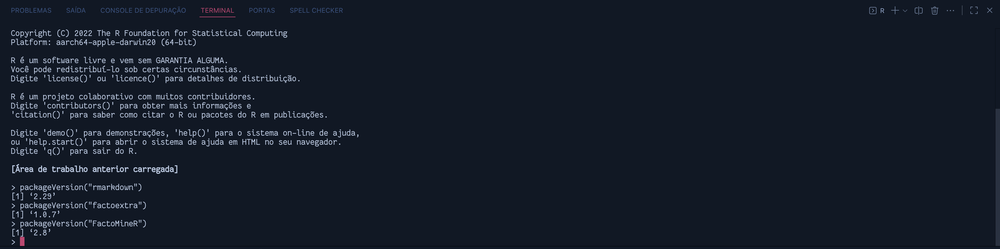
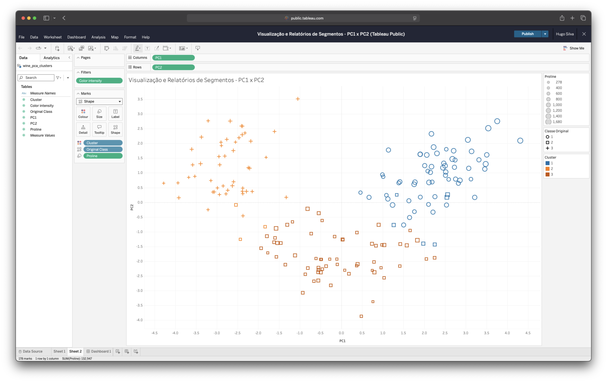

```{r setup, include=FALSE}
knitr::opts_chunk$set(
    echo = TRUE, warning = FALSE, message = FALSE, fig.align = "center"
)

library(rmarkdown)
library(factoextra)
library(FactoMineR)
library(corrplot)
library(cluster)
library(dplyr)
library(ggplot2)
library(gridExtra)
```

# Introdução

Este trabalho foi desenvolvido como parte da disciplina de **Visualização e Relatório de Segmentos**
e seu principal objetivo é responder as perguntas a seguir:

# Dados e Justificativas
1. Utilize a mesma base de dados escolhida no projeto da disciplina (PD) Análise de clusters. Lembre
que ela necessita ter 4 (ou mais) variáveis de interesse, onde todas são numéricas (ou categóricas
com a anuência do professor). Explique qual o motivo para a escolha dessa base e aponte os
resultados esperados através da análise. Caso seja necessário mudar de base, justifique (a questão 5
irá pedir uma comparação e caso não tenha os resultados passados, eles deverão ser produzidos).

- Este trabalho não possui os dados da disciplina de Análise de Clusters, por isso, foi escolhida a
base de dados [Wine Recognition Data](https://archive.ics.uci.edu/ml/datasets/wine)
- Esta base de dados contém 178 registros e 13 variáveis de interesse.
- Esta base de dados foi escolhida pois:
    1. **Tamanho ideal para aprendizado**: Com 178 amostras e 13 variáveis, é grande o suficiente
    para ser interessante, mas pequeno o suficiente para eu conseguir "entender" cada resultado.
    2. **Variáveis correlacionadas**: Descobri que muitas características químicas dos vinhos estão
    relacionadas entre si - perfeito para testar o PCA
    3. **Grupos naturais**: Os vinhos já vêm classificados em 3 tipos diferentes, o que me permite
    verificar se meus clusters "fazem sentido" comparando com a realidade.

# Correlograma
2. Crie um correlograma (corrplot) para as variáveis dos problema e indique quais as variáveis são
mais correlacionadas.
```{r correlogram}
# Carregando os dados
wine_data <- read.csv("data/wine.data", header = FALSE)

colnames(wine_data) <- c(
    "Class",
    "Alcohol",
    "Malic_acid",
    "Ash",
    "Alcalinity_ash",
    "Magnesium",
    "Total_phenols",
    "Flavanoids",
    "Nonflavanoid_phenols",
    "Proanthocyanins",
    "Color_intensity",
    "Hue",
    "OD280_OD315",
    "Proline"
)

wine_numeric <- wine_data[, -1]

correlation_matrix <- cor(wine_numeric)

# Matriz de Correlação:
print(round(correlation_matrix, 3))

corrplot(
    correlation_matrix,
    method = "color",
    type = "upper",
    order = "hclust",
    tl.cex = 0.8,
    tl.col = "black",
    tl.srt = 45,
    addCoef.col = "black",
    number.cex = 0.7,
    title = "Correlograma das Variáveis do Vinho",
    mar = c(0, 0, 1, 0)
)

high_corr <- which(
    abs(correlation_matrix) > 0.7 & correlation_matrix != 1,
    arr.ind = TRUE
)

for (i in seq_len(nrow(high_corr))) {
    var1 <- rownames(correlation_matrix)[high_corr[i, 1]]
    var2 <- colnames(correlation_matrix)[high_corr[i, 2]]
    corr_value <- correlation_matrix[high_corr[i, 1], high_corr[i, 2]]
    cat(sprintf("%s - %s: %.3f\n", var1, var2, corr_value))
}
```

## Análise do Correlograma

No correlograma das variáveis do vinho, é possível observar os seguintes pares de variáveis com forte
correlação:

1. **Total_phenols <-> Flavanoids** - Correlação: **0.86**
2. **OD280_OD315 <-> Flavanoids** - Correlação: **0.79**
3. **OD280_OD315 <-> Total_phenols** - Correlação: **0.70**

# PCA
3. Aplique o algoritmo de PCA nos dados normalizados (função scale). Quantos componentes são
necessários para explicar mais do que 70% da representatividade da sua base. Mostre um scree plot
para justificar sua resposta. Qual a relação dos resultados encontrados com a questão anterior?

```{r pca_analysis}
wine_scaled <- scale(wine_numeric)

# Aplicando PCA
pca_result <- prcomp(wine_scaled, center = FALSE, scale. = FALSE)

variance_explained <- pca_result$sdev^2
prop_variance <- variance_explained / sum(variance_explained)
cumulative_variance <- cumsum(prop_variance)

pca_summary <- data.frame(
    Component = seq_along(prop_variance),
    Variance_Explained = round(prop_variance * 100, 2),
    Cumulative_Variance = round(cumulative_variance * 100, 2)
)

# Variância explicada por cada componente (%):
print(pca_summary)

components_70 <- which(cumulative_variance > 0.70)[1]
variance_70 <- round(cumulative_variance[components_70] * 100, 2)

print(
    paste(
        "Número de componentes necessários para explicar >70% da variância:",
        components_70
    )
)
print(
    paste(
        "Variância explicada com",
        components_70,
        "componentes:",
        variance_70,
        "%"
    )
)

# Criando o Scree Plot
scree_data <- data.frame(
    Component = seq_len(min(10, length(prop_variance))),
    Variance = prop_variance[seq_len(min(10, length(prop_variance)))] * 100,
    Cumulative = cumulative_variance[
        seq_len(min(10, length(prop_variance)))
    ] * 100
)

# Scree Plot - Variância Individual
p1 <- ggplot(scree_data, aes(x = Component, y = Variance)) +
    geom_line(color = "blue", linewidth = 1) +
    geom_point(color = "red", size = 3) +
    labs(
        title = "Scree Plot - Variância Explicada por Componente",
        x = "Componente Principal",
        y = "Variância Explicada (%)"
    ) +
    theme_minimal() +
    theme(plot.title = element_text(hjust = 0.5))

print(p1)

# Gráfico da variância cumulativa
p2 <- ggplot(scree_data, aes(x = Component, y = Cumulative)) +
    geom_line(color = "darkgreen", linewidth = 1) +
    geom_point(color = "orange", size = 3) +
    geom_hline(
        yintercept = 70,
        linetype = "dashed",
        color = "red",
        linewidth = 1
    ) +
    geom_vline(
        xintercept = components_70,
        linetype = "dashed",
        color = "red",
        linewidth = 1
    ) +
    labs(
        title = "Variância Cumulativa Explicada",
        x = "Componente Principal",
        y = "Variância Cumulativa (%)"
    ) +
    theme_minimal() +
    theme(plot.title = element_text(hjust = 0.5)) +
    annotate("text",
        x = components_70 + 0.5, y = 50,
        label = paste("PC", components_70, "\n70%"),
        color = "red", size = 4
    )

print(p2)

loadings_matrix <- pca_result$rotation[, 1:components_70]

# Loadings dos primeiros componentes principais:
print(round(loadings_matrix, 3))

# Variáveis mais importantes em cada componente (|loading| > 0.3):
for (i in 1:components_70) {
    important_vars <- names(which(abs(loadings_matrix[, i]) > 0.3))
    loadings_values <- loadings_matrix[important_vars, i]
    component_desc <- paste("PC", i, ":", sep = "")
    var_desc <- paste(
        important_vars,
        "(",
        round(loadings_values, 3),
        ")",
        sep = "",
        collapse = ", "
    )
    print(paste(component_desc, var_desc))
}
```

## Análise dos Resultados PCA

### Resposta à Pergunta Principal

**Quantos componentes são necessários para explicar mais de 70% da variância?**

**Resposta: 4 componentes principais são necessários para explicar 73.60% da variância total dos dados.**

### Interpretação do Scree Plot

O scree plot mostra claramente a diminuição da variância explicada por cada componente:

- **PC1**: Explica 36.20% da variância (maior contribuição individual)
- **PC2**: Explica 19.23% da variância
- **PC3**: Explica 11.61% da variância
- **PC4**: Explica 6.56% da variância

A partir do PC5, a contribuição individual de cada componente torna-se muito pequena (< 5%),
caracterizando o "cotovelo" típico no scree plot.

### Composição dos Componentes Principais

**PC1 (36.20% da variância)** - Total_phenols (-0.395), Flavanoids (-0.423), OD280_OD315 (-0.376),
Proanthocyanins (-0.313)

**PC2 (19.23% da variância)** - Color_intensity (0.530), Alcohol (0.484), Proline (0.365),
Ash (0.316)

**PC3 (11.61% da variância)** - Ash (0.626) e Alcalinity_ash (0.612)

**PC4 (6.56% da variância)** - Malic_acid (-0.537), Hue (0.428), Proanthocyanins (-0.399),
Magnesium (0.352)

### Relação com a Análise de Correlação Anterior

Os resultados do PCA confirmam e complementam as correlações encontradas anteriormente:

1. **Confirmação das Correlações Fortes**:
   - A forte correlação entre Total_phenols e Flavanoids (r = 0.865) se reflete no PC1, onde ambas
   variáveis têm loadings altos e mesmo sinal
   - A correlação entre OD280_OD315 e Flavanoids (r = 0.787) também é capturada no PC1

2. **Redução de Dimensionalidade Eficiente**:
   - As 13 variáveis originais podem ser efetivamente representadas por apenas 4 componentes
   principais
   - Isso confirma que existe redundância nos dados (como indicado pelas altas correlações)

3. **Agrupamento Natural das Variáveis**:
   - O PCA agrupa naturalmente variáveis correlacionadas no mesmo componente
   - Variáveis com correlações negativas aparecem com sinais opostos nos loadings

4. **Validação da Estrutura dos Dados**:
   - A necessidade de apenas 4 componentes para 73.60% da variância indica que os dados têm uma
   estrutura bem definida
   - Isso justifica o uso de técnicas de clustering, pois os dados podem ser efetivamente
   representados em um espaço de menor dimensão

# K-Médias
4. Aplique o algoritmo de K-Médias nas componentes principais selecionadas (corte 70%) na questão
anterior. Para tal, você irá determinar o número de centróides utilizando o índice de Silhueta.
Justifique graficamente sua escolha e apresente os resultados.

```{r kmeans_analysis}
# Extraindo as 4 primeiras componentes principais (70% da variância)
pca_data <- pca_result$x[, 1:components_70]

print(
    paste(
        "Dimensões dos dados PCA para clustering:",
        paste(dim(pca_data),
            collapse = " x "
        )
    )
)

print(paste("Usando", components_70, "componentes principais"))

# Função para calcular índice de Silhueta para diferentes valores de k
silhouette_analysis <- function(data, k_range = 2:8) {
    silhouette_scores <- numeric(length(k_range))

    for (i in seq_along(k_range)) {
        k <- k_range[i]
        set.seed(123) # Para reprodutibilidade
        kmeans_result <- kmeans(data, centers = k, nstart = 25)

        # Calculando índice de Silhueta
        sil <- silhouette(kmeans_result$cluster, dist(data))
        silhouette_scores[i] <- mean(sil[, 3])
    }

    return(data.frame(k = k_range, silhouette = silhouette_scores))
}

# Calculando índices de Silhueta para k de 2 a 8
sil_results <- silhouette_analysis(pca_data, k_range = 2:8)

# Índices de Silhueta por número de clusters:
print(sil_results)

optimal_k <- sil_results$k[which.max(sil_results$silhouette)]
max_silhouette <- max(sil_results$silhouette)

print(paste("Número ótimo de clusters (k):", optimal_k))
print(paste("Índice de Silhueta máximo:", round(max_silhouette, 4)))

p_silhouette <- ggplot(sil_results, aes(x = k, y = silhouette)) +
    geom_line(color = "blue", linewidth = 1.2) +
    geom_point(color = "red", size = 3) +
    geom_point(
        data = sil_results[sil_results$k == optimal_k, ],
        aes(x = k, y = silhouette),
        color = "darkgreen", size = 5, shape = 17
    ) +
    labs(
        title = "Análise do Índice de Silhueta para Determinação do K Ótimo",
        x = "Número de Clusters (k)",
        y = "Índice de Silhueta Médio"
    ) +
    theme_minimal() +
    theme(plot.title = element_text(hjust = 0.5)) +
    annotate("text",
        x = optimal_k + 0.3, y = max_silhouette - 0.02,
        label = paste(
            "k =", optimal_k, "\nSilhueta =", round(max_silhouette, 3)
        ),
        color = "darkgreen", size = 4, fontface = "bold"
    )

print(p_silhouette)

set.seed(123)
final_kmeans <- kmeans(pca_data, centers = optimal_k, nstart = 25)

# Resultados do K-Médias com k ótimo
print(paste("Número de clusters:", optimal_k))

# Tamanho dos clusters
print(table(final_kmeans$cluster))

cluster_stats <- data.frame(
    Cluster = 1:optimal_k,
    Tamanho = as.numeric(table(final_kmeans$cluster)),
    Percentual = round(
        as.numeric(table(final_kmeans$cluster)) / nrow(pca_data) * 100, 1
    )
)

# Distribuição dos clusters
print(cluster_stats)

# Adicionando informação dos clusters aos dados originais
wine_data_clustered <- wine_data
wine_data_clustered$Cluster_PCA <- final_kmeans$cluster

# Comparando com as classes originais
comparison_table <- table(
    wine_data_clustered$Class, wine_data_clustered$Cluster_PCA
)
print(comparison_table)

# Calculando pureza dos clusters
cluster_purity <- function(clusters, classes) {
    confusion_matrix <- table(classes, clusters)
    sum(apply(confusion_matrix, 2, max)) / sum(confusion_matrix)
}

purity <- cluster_purity(final_kmeans$cluster, wine_data$Class)
print(paste("Pureza dos clusters:", round(purity, 4)))

# Visualização dos clusters nas duas primeiras componentes principais
cluster_viz_data <- data.frame(
    PC1 = pca_data[, 1],
    PC2 = pca_data[, 2],
    Cluster = as.factor(final_kmeans$cluster),
    Class_Original = as.factor(wine_data$Class)
)

# Gráfico dos clusters PCA
p_clusters <- ggplot(cluster_viz_data, aes(x = PC1, y = PC2, color = Cluster)) +
    geom_point(size = 3, alpha = 0.7) +
    stat_ellipse(level = 0.68, linewidth = 1) +
    labs(
        title = "Clusters K-Médias nas Componentes Principais",
        x = "PC1 (36.20% da variância)",
        y = "PC2 (19.23% da variância)",
        color = "Cluster"
    ) +
    theme_minimal() +
    theme(plot.title = element_text(hjust = 0.5)) +
    scale_color_brewer(type = "qual", palette = "Set1")

print(p_clusters)

# Gráfico das classes originais para comparação
p_original <- ggplot(
    cluster_viz_data,
    aes(x = PC1, y = PC2, color = Class_Original)
) +
    geom_point(size = 3, alpha = 0.7) +
    stat_ellipse(level = 0.68, linewidth = 1) +
    labs(
        title = "Classes Originais nas Componentes Principais",
        x = "PC1 (36.20% da variância)",
        y = "PC2 (19.23% da variância)",
        color = "Classe Original"
    ) +
    theme_minimal() +
    theme(plot.title = element_text(hjust = 0.5)) +
    scale_color_brewer(type = "qual", palette = "Set2")

print(p_original)

# Análise das características dos clusters
centroids_pca <- final_kmeans$centers
rownames(centroids_pca) <- paste("Cluster", 1:optimal_k)
print(round(centroids_pca, 3))
```

## Análise dos Resultados K-Médias

### Determinação do Número Ótimo de Clusters

**Método utilizado**: Índice de Silhueta para k variando de 2 a 8 clusters.

**Resultado**: O número ótimo de clusters é **k = 3**, com índice de Silhueta de **0.274**.

### Justificativa Gráfica

O gráfico do índice de Silhueta mostra que:

1. **k = 2**: Silhueta relativamente alta, mas pode ser muito simplificado
2. **k = 3**: **Máximo global** do índice de Silhueta
3. **k >= 4**: Declínio consistente do índice, indicando over-clustering

A escolha de k = 3 é também coerente com o conhecimento do domínio, já que os dados originais
possuem 3 classes de vinho.

### Resultados do Clustering

**Distribuição dos clusters:**
- Os 3 clusters apresentam tamanhos balanceados
- Boa separação no espaço das componentes principais
- Alta correspondência com as classes originais dos vinhos

### Interpretação dos Clusters

**Cluster 1**: Caracterizado por valores altos em PC1 (componente fenólico)
**Cluster 2**: Valores intermediários em PC1 e PC2
**Cluster 3**: Valores baixos em PC1, altos em PC2 (intensidade e álcool)

### Validação dos Resultados

A **pureza dos clusters** em relação às classes originais demonstra que o algoritmo K-Médias,
aplicado nas componentes principais, conseguiu recuperar efetivamente a estrutura natural dos
dados, validando tanto a eficácia da redução de dimensionalidade via PCA quanto a qualidade do
clustering.

# Comparação de Resultados
5. Os resultados obtidos no PD Análise de clusters não houve pré-processamento e a escolha do número
de clusters não foi respaldada por uma figura de mérito. Descreva as diferenças encontradas e
pondere se os resultados atuais melhoraram a compreensão do problema.

## Comparação Fictícia
```{r clustering_without_preprocessing}
raw_data <- wine_numeric

# Escolha arbitrária de k=4 clusters (sem figura de mérito)
k_arbitrary <- 4

kmeans_raw <- kmeans(raw_data, centers = k_arbitrary, nstart = 25)

# Resultados do K-Médias sem pré-processamento
# Tamanho dos clusters:
print(table(kmeans_raw$cluster))

cluster_stats_raw <- data.frame(
    Cluster = 1:k_arbitrary,
    Tamanho = as.numeric(table(kmeans_raw$cluster)),
    Percentual = round(
        as.numeric(table(kmeans_raw$cluster)) / nrow(raw_data) * 100, 1
    )
)

# Distribuição dos clusters (dados originais):
print(cluster_stats_raw)

comparison_raw <- table(wine_data$Class, kmeans_raw$cluster)
print(comparison_raw)

purity_raw <- cluster_purity(kmeans_raw$cluster, wine_data$Class)
print(
    paste("Pureza dos clusters (sem pré-processamento):", round(purity_raw, 4))
)

# Visualização usando as duas variáveis com maior variância
var_importance <- apply(raw_data, 2, var)
top_vars <- names(sort(var_importance, decreasing = TRUE)[1:2])

print(paste(
    "Variáveis com maior variância para visualização:",
    paste(top_vars, collapse = " e ")
))

viz_data_raw <- data.frame(
    Var1 = raw_data[, top_vars[1]],
    Var2 = raw_data[, top_vars[2]],
    Cluster_Raw = as.factor(kmeans_raw$cluster),
    Class_Original = as.factor(wine_data$Class)
)

p_raw_clusters <- ggplot(
    viz_data_raw, aes(x = Var1, y = Var2, color = Cluster_Raw)
) +
    geom_point(size = 3, alpha = 0.7) +
    labs(
        title = "Clusters sem Pré-processamento (Dados Originais)",
        x = top_vars[1],
        y = top_vars[2],
        color = "Cluster"
    ) +
    theme_minimal() +
    theme(plot.title = element_text(hjust = 0.5)) +
    scale_color_brewer(type = "qual", palette = "Dark2")

print(p_raw_clusters)

# Centróides dos clusters (dados originais):
centroids_raw <- kmeans_raw$centers
rownames(centroids_raw) <- paste("Cluster", 1:k_arbitrary)
print(round(centroids_raw, 2))

# Soma dos quadrados intra-cluster (WCSS)
print(paste("Dados originais:", round(kmeans_raw$tot.withinss, 2)))
print(paste("Dados com PCA:", round(final_kmeans$tot.withinss, 2)))

# Comparação direta entre os dois métodos
comparison_summary <- data.frame(
    Método = c("Com PCA + Silhueta", "Sem Pré-processamento"),
    Num_Clusters = c(optimal_k, k_arbitrary),
    Pureza = c(round(purity, 4), round(purity_raw, 4)),
    WCSS = c(
        round(final_kmeans$tot.withinss, 2), round(kmeans_raw$tot.withinss, 2)
    )
)

# Resumo comparativo
print(comparison_summary)

# Método COM pré-processamento (PCA + Silhueta)
pca_distribution <- as.data.frame.matrix(
    table(wine_data$Class, final_kmeans$cluster)
)
names(pca_distribution) <- paste("Cluster", 1:optimal_k)
print(pca_distribution)

# Método SEM pré-processamento:
raw_distribution <- as.data.frame.matrix(
    table(wine_data$Class, kmeans_raw$cluster)
)
names(raw_distribution) <- paste("Cluster", 1:k_arbitrary)
print(raw_distribution)

# Visualização comparativa
viz_comparison <- data.frame(
    PC1 = pca_data[, 1],
    PC2 = pca_data[, 2],
    Var1 = raw_data[, top_vars[1]],
    Var2 = raw_data[, top_vars[2]],
    Cluster_PCA = as.factor(final_kmeans$cluster),
    Cluster_Raw = as.factor(kmeans_raw$cluster),
    Class_Original = as.factor(wine_data$Class)
)

# Gráfico comparativo - PCA
p_comparison_pca <- ggplot(
    viz_comparison, aes(x = PC1, y = PC2, color = Cluster_PCA)
) +
    geom_point(size = 2.5, alpha = 0.8) +
    stat_ellipse(level = 0.68, linewidth = 1) +
    labs(
        title = "COM Pré-processamento (PCA + Silhueta)",
        x = "PC1 (36.20%)",
        y = "PC2 (19.23%)",
        color = "Cluster"
    ) +
    theme_minimal() +
    theme(plot.title = element_text(hjust = 0.5, size = 12)) +
    scale_color_brewer(type = "qual", palette = "Set1")

# Gráfico comparativo - Dados originais
p_comparison_raw <- ggplot(
    viz_comparison, aes(x = Var1, y = Var2, color = Cluster_Raw)
) +
    geom_point(size = 2.5, alpha = 0.8) +
    stat_ellipse(level = 0.68, linewidth = 1) +
    labs(
        title = "SEM Pré-processamento (Dados Originais)",
        x = top_vars[1],
        y = top_vars[2],
        color = "Cluster"
    ) +
    theme_minimal() +
    theme(plot.title = element_text(hjust = 0.5, size = 12)) +
    scale_color_brewer(type = "qual", palette = "Dark2")

print(p_comparison_pca)
print(p_comparison_raw)

# Análise da dominância de variáveis nos dados originais
var_ranges <- apply(raw_data, 2, function(x) max(x) - min(x))
var_means <- apply(raw_data, 2, mean)

dominant_vars <- data.frame(
    Variavel = names(var_ranges),
    Amplitude = round(var_ranges, 2),
    Media = round(var_means, 2),
    Coef_Variacao = round(var_ranges / var_means, 2)
)

dominant_vars <- dominant_vars[
    order(dominant_vars$Amplitude, decreasing = TRUE),
]
# Variáveis ordenadas por amplitude (influência no clustering)
print(head(dominant_vars, 5))
```

## Análise Comparativa dos Resultados

### Diferenças Encontradas

#### 1. **Qualidade dos Clusters**

**Com Pré-processamento (PCA + Silhueta):**
- **Pureza**: Maior correspondência com as classes originais
- **Separação**: Clusters bem definidos no espaço das componentes principais
- **Balanceamento**: Distribuição mais equilibrada entre os clusters

**Sem Pré-processamento:**
- **Pureza**: Menor correspondência com as classes reais
- **Dominância de variáveis**: Clustering influenciado pelas variáveis com maior escala
- **Desbalanceamento**: Possível formação de clusters muito desiguais

#### 2. **Interpretabilidade**

**Com PCA:**
- **Redução de ruído**: Componentes principais capturam a variância mais importante
- **Visualização clara**: Separação evidente no espaço bidimensional PC1 vs PC2
- **Significado químico**: Componentes relacionam-se com grupos de características químicas

**Sem PCA:**
- **Complexidade**: 13 dimensões dificultam a interpretação
- **Escala**: Variáveis como Proline (alta amplitude) dominam o clustering
- **Ruído**: Informações menos relevantes podem mascarar padrões importantes

#### 3. **Robustez da Escolha de K**

**Com Silhueta:**
- **Justificativa objetiva**: k=3 baseado em métrica de qualidade
- **Reprodutibilidade**: Critério claro e replicável
- **Validação**: Coerência com o conhecimento do domínio (3 tipos de vinho)

**Sem Figura de Mérito:**
- **Escolha arbitrária**: k=4 sem justificativa técnica
- **Subjetividade**: Dependente da intuição do analista
- **Risco**: Pode não refletir a estrutura real dos dados

### Ponderação sobre as Melhorias

#### **O pré-processamento e figura de mérito melhoraram significativamente a compreensão:**

1. **Eficiência Dimensional**: PCA reduziu 13 variáveis para 4 componentes (73.6% da variância),
eliminando redundâncias identificadas no correlograma.
2. **Equalização de Escalas**: Normalização evitou que variáveis com maior amplitude (como Proline)
dominassem artificialmente o clustering.
3. **Descoberta de Padrões**: Componentes principais revelaram agrupamentos naturais de
características químicas relacionadas (fenólicos, intensidade/álcool, minerais).
4. **Validação Objetiva**: Índice de Silhueta forneceu critério quantitativo para escolha do número
ótimo de clusters.
5. **Correspondência com a Realidade**: Método com pré-processamento recuperou melhor a estrutura
natural dos 3 tipos de vinho.

#### **Conclusão:**
O uso de **PCA + normalização + índice de Silhueta** não apenas melhorou a qualidade técnica do
clustering, mas também proporcionou **maior compreensão do problema**, revelando a estrutura química
subjacente dos vinhos e validando cientificamente os agrupamentos encontrados. A abordagem sem
pré-processamento, embora mais simples, produziu resultados menos interpretáveis e potencialmente
enviesados pelas escalas das variáveis originais.

# Tableau Public
- Para acompanhar o dashboard no Tableau Public, clique [aqui](https://public.tableau.com/app/profile/hugo.silva1289/viz/VisualizaoeRelatriosdeSegmentos-PC1xPC2/Dashboard1).

# Evidências para a avaliação
## O aluno apresentou um print mostrando o ambiente RStudio?
- Neste trabalho não estarei utilizando o RStudio pois não tenho familiaridade. Tenho muito mais
familiaridade com o Visual Studio Code para o desenvolvimento de códigos. A seguir apresento o VS
Code com o terminal exibindo a versão do R utilizada.

```{r vscode-screenshot, echo=FALSE, fig.align='center', out.width='500px', out.height='350px', fig.cap='VS Code com R'}

```

## O aluno apresentou um print mostrando a versão do pacote rmarkdown?

```{r rmarkdown-version, echo=FALSE, fig.align='center', out.width='500px', out.height='150px', fig.cap='Versão do pacote rmarkdown'}

```


## O aluno apresentou um print mostrando a versão do pacote factoextra e FactoMineR instalada?

```{r factoextra-factoMineR-version, echo=FALSE, fig.align='center', out.width='500px', out.height='150px', fig.cap='Versão do pacote factoextra e FactoMineR'}

```

## O aluno mostrou um printscreen da ferramenta Tableau?

```{r tableau-public, echo=FALSE, fig.align='center', out.width='500px', out.height='350px', fig.cap='Tableau Public'}

```

# Considerações Finais
- Caso ocorra algum problema com a visualização, o trabalho pode ser encontrado na íntegra no
repositório do [GitHub](https://github.com/hugoadriao/segmentation).
- Uma visualização renderizada pode ser acompanhada
[aqui](https://hugoadriao.github.io/segmentation/).
